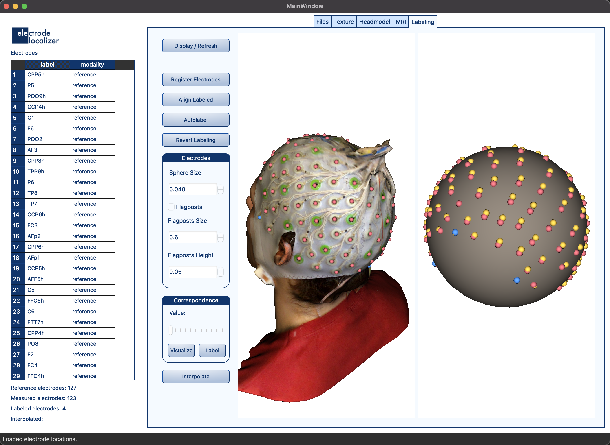

[]()
[](https://github.com/psf/black)

# ELK: Electrode Localization Kit


## Overview

Accurate localization of EEG scalp electrodes is crucial for precisely estimating the underlying neuronal activity from observed electrical potential changes on the scalp. Various techniques for electrode localization have been proposed, categorized into direct measurements on the subject's head or indirect methods utilizing structural MRI scans. Most direct measurement methods are expensive as they rely on complex stereo vision systems or are magnetic-field-driven, making them especially inconvenient for experiments involving simultaneous EEG-fMRI acquisition and cannot be used in the vicinity of the MRI scanner. Indirect methods are susceptible to artifacts, particularly with high-density EEG caps, where dense wire bundles cause signal dropouts on MR images.

To address these challenges, we present an open-source Python environment for electrode localization. Our approach utilizes surface models of the human head generated from data acquired by affordable IR stereo structured light projection cameras and/or structural MRI head scans. Our primary objective was to streamline the electrode localization process, reducing both acquisition and processing time. We achieved automated electrode detection from head texture images and electrode labeling from template location files, reducing the acquisition and processing time together to under 5 minutes. Our environment enhances efficiency and accuracy in EEG electrode localization, facilitating seamless integration into neuroimaging workflows.

  

## Key Features

- **Affordable IR Stereo Structured Light Projection Cameras**: Utilizes cost-effective equipment for generating surface models.
- **Structural MRI Head Scans**: Compatible with MRI scans to improve localization accuracy.
- **Automated Electrode Detection and Labeling**: Reduces acquisition and processing time to under 5 minutes.
- **Open-Source**: Freely available Python package to streamline electrode localization.

## Installation

To install the required dependencies for ELK, use the following command:

```sh
pip install -r requirements.txt
```

The `requirements.txt` file includes the following packages and their versions:

```
nibabel==5.2.1
numpy==1.25.0
opencv_python==4.8.1.78
pandas==2.2.2
PyQt6==6.7.0
PyQt6_sip==13.6.0
vedo==2023.4.6
vtk==9.2.6
```

## Supported Formats

The package currently supports:

- **.ced** manufacturer's electrode locations
- FreeSurfer head surface files generated with the **BEM** flag (e.g., `recon-all -s <subject> -all -make` and `mne watershed_bem -s <subject>`)

The package was tested on structural scans acquired using the Structure Sensor on an Apple iPad and iTSeez3D software.

## Authors

- **Aleksij Kraljič** (corresponding author) - Mind and Brain Lab, Department of Psychology, Faculty of Arts, University of Ljubljana
- **Jure Demšar** - Faculty of Computer and Information Science, University of Ljubljana, and Mind and Brain Lab, Department of Psychology, Faculty of Arts, University of Ljubljana
- **Grega Repovš** (Lab Director) - Mind and Brain Lab, Department of Psychology, Faculty of Arts, University of Ljubljana

## Contact

For help and support, please contact:

- Aleksij Kraljič: <aleksij.kraljic@ff.uni-lj.si> or <alex.kraljic@gmail.com>

## Version

The current version of the package is **0.3.1**.

## License

This project is licensed under the GNU General Public License (GPL) - see the [LICENSE](LICENSE) file for details.

## Acknowledgments

We would like to thank the University of Ljubljana, Faculty of Arts, and the Faculty of Computer and Information Science for their support in this project.

## Developers

### Code Formatting

The code is formatted using **[Black](https://black.readthedocs.io/en/stable/)**. Black is an uncompromising Python code formatter that ensures your code has a consistent style by automatically formatting your Python code to be as readable and maintainable as possible. Black enforces a specific style guide, which saves developers time on formatting debates and keeps the codebase clean and uniform.

To format your code using Black, you can install it via pip and then run it on your codebase:

```sh
pip install black
black .
```

### Versioning

We are using **Semantic Versioning** for this project. For details, see [Semantic Versioning](https://semver.org/).

### Git Workflow

We follow the **[Gitflow](https://nvie.com/posts/a-successful-git-branching-model/)** workflow. This means our development process includes feature branches, release branches, and hotfix branches. Here's a basic overview:

1. **Feature Branches**: All new features should be developed in dedicated branches created from the `develop` branch. Name these branches clearly, e.g., `feature/awesome-new-feature`.

2. **Release Branches**: When it's time to prepare a new release, create a branch from `develop` named `release/x.x.x`.

3. **Hotfix Branches**: For urgent fixes that need to go into production immediately, create a branch from `main` named `hotfix/x.x.x`.

4. **Merging**: Feature branches are merged back into `develop`. Release branches are merged into both `main` and `develop`. Hotfix branches are merged into both `main` and `develop`.

### Commit Messages

Commit messages should be clear and descriptive. Follow this structure:

- **Header**: A brief summary of the changes (50 characters max).
- **Body**: Detailed explanation of what has been done and why (if necessary).
- **Footer**: Any references to issues or tickets (if applicable).

Use the following prefixes to categorize your commits:

- **feat:** A new feature for the user.
- **fix:** A bug fix.
- **docs:** Changes to the documentation.
- **style:** Changes that do not affect the meaning of the code (white-space, formatting, missing semi-colons, etc.).
- **refactor:** A code change that neither fixes a bug nor adds a feature.
- **perf:** A code change that improves performance.
- **test:** Adding missing or correcting existing tests.
- **chore:** Changes to the build process or auxiliary tools and libraries such as documentation generation.

Example:

```
feat: add automated electrode detection

This commit introduces automated detection of electrodes from head texture images, 
significantly reducing the manual effort required in the localization process.

Fixes #42
```

### Writing Good Commit Messages

[The seven rules of a great Git commit message](https://cbea.ms/git-commit/)

- Keep in mind: This has all been said before.
- Separate subject from body with a blank line
- Limit the subject line to 50 characters
- Capitalize the subject line
- Do not end the subject line with a period
- Use the imperative mood in the subject line
- Wrap the body at 72 characters
- Use the body to explain what and why vs. how

[Atomic Commits](https://www.freshconsulting.com/insights/blog/atomic-commits/)

- Commit each fix or task as a separate change
- Only commit when a block of work is complete
- Commit each layout change separately
- Joint commit for layout file, code behind file, and additional resources

### Pull Requests

To contribute, follow these steps:

1. Fork the repository and clone your fork.
2. Create a new branch for your feature or bugfix.
3. Make your changes and commit them with clear commit messages.
4. Push your branch to your fork.
5. Open a pull request against the `develop` branch of the main repository.

Ensure your pull request includes:

- A clear description of what the changes do and why they are necessary.
- Any relevant issue numbers.

## Citation

If you use ELK in your research, please cite our GitHub repository as follows:

```
@misc{ELK2023,
  title={ELK: Electrode Localization Kit},
  author={Aleksij Kraljič, Jure Demšar, Grega Repovš},
  year={2023},
  url={https://github.com/your-repo-link}
}
```

---

This `README.md` provides an overview of the ELK package, including its key features, installation instructions, supported formats, authorship, contact information, current version, and license details. For any additional information or assistance, please reach out to the provided contact emails.
